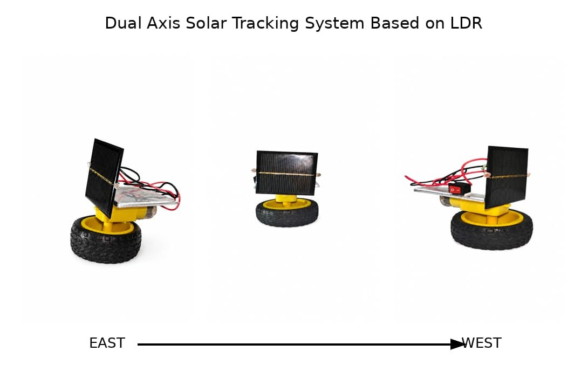

# <h1 align="center">DUAL-AXIS SOLAR TRACKING SYSTEM</h1>

<p align="center">
An automatic Dual-Axis Solar Tracking System that continuously aligns a solar panel with the sun using two LDR sensors, a TDA2822 IC, and DC geared motors to improve solar energy collection.
</p>

---

## Table of Contents

- Overview
- Project Image
- Problem Statement
- Tools and Technologies
- Hardware Components
- Circuit Diagram
- System Architecture
- Working Methodology
- How to Run This Project
- Future Improvements
- Project Structure
- Author & Contact

---

# Overview

This project presents the design and implementation of a Dual-Axis Solar Tracking System that automatically adjusts the orientation of a solar panel in both horizontal (azimuth) and vertical (elevation) directions to maximize sunlight exposure.

The system uses two Light Dependent Resistors (LDRs) to detect differences in sunlight intensity. These signals are processed using a TDA2822 IC, which controls two DC geared motors responsible for rotating the panel until it faces the direction of maximum sunlight.

The project demonstrates a simple, low-cost, and efficient approach to automatic solar tracking for educational purposes and small-scale renewable energy applications.

---

# Project Image



---

# Problem Statement

Conventional solar panels remain fixed after installation and cannot continuously face the sun. As the sun changes position throughout the day, the panel receives less direct sunlight, reducing the amount of energy generated.

This project aims to develop a simple and affordable Dual-Axis Solar Tracking System that automatically adjusts the solar panel position using light sensors and DC geared motors to maximize sunlight exposure.

---

# Tools and Technologies

## Hardware

- Solar Panel
- 2 × LDR Sensors
- TDA2822 IC
- 2 × DC Geared Motors
- 9V Battery
- Connecting Wires
- Mounting Frame

## Software

- Fritzing
- Microsoft Word
- Microsoft PowerPoint

## Technologies

- Solar Energy
- Renewable Energy Systems
- Embedded Hardware
- Analog Signal Processing

---

# Hardware Components

| Component | Quantity |
|-----------|----------|
| Solar Panel | 1 |
| LDR Sensor | 2 |
| TDA2822 IC | 1 |
| DC Geared Motor | 2 |
| 9V Battery | 1 |
| Connecting Wires | As Required |
| Mounting Frame | 1 |

---

# Circuit Diagram

The following diagram illustrates the circuit connections used in the project.


### Circuit Description

- Two LDR sensors detect the direction of maximum sunlight.
- The voltage difference between the LDRs is processed by the TDA2822 IC.
- The IC controls the DC geared motors.
- The motors rotate the solar panel until it receives maximum sunlight.
- The system operates using a 9V battery supply.

---

# System Architecture

```text
             Sunlight
                 │
                 ▼
          Two LDR Sensors
                 │
                 ▼
            TDA2822 IC
                 │
                 ▼
         DC Geared Motors
                 │
                 ▼
      Dual-Axis Panel Movement
                 │
                 ▼
      Maximum Sunlight Exposure
```

---

# Working Methodology

1. Assemble the supporting frame.
2. Mount the solar panel.
3. Install the two LDR sensors.
4. Connect the sensors to the TDA2822 IC.
5. Connect the two DC geared motors.
6. Connect the 9V battery.
7. Place the setup under sunlight.
8. The LDR sensors continuously monitor light intensity.
9. The TDA2822 IC processes the sensor signals.
10. The motors rotate the panel toward the direction of maximum sunlight.
11. The tracking process continues automatically throughout the day.

---

# How to Run This Project

## Step 1: Hardware Assembly

- Mount the solar panel.
- Install the two LDR sensors.
- Connect the TDA2822 IC.
- Connect the DC geared motors.
- Connect the 9V battery.

## Step 2: Testing

- Place the setup under direct sunlight.
- Switch on the power supply.
- Observe the movement of the solar panel.
- Verify tracking in both horizontal and vertical directions.

---

# Future Improvements

- ESP32 integration
- IoT-based remote monitoring
- Mobile application support
- Weather monitoring
- Maximum Power Point Tracking (MPPT)
- Solar data logging

---

# Project Structure

```text
Dual-Axis-Solar-Tracker/
│
├── README.md
├── LICENSE
│
├── docs/
│   └── Project_Report.pdf
│
├── hardware/
│   └── BOM.md
│
├── circuit/
│   └── Circuit_Diagram.jpg
│
└── images/
    └── diagram.jpg
```

---

# Author & Contact

**Project:** Dual-Axis Solar Tracking System

**Author:** Yashaswini Devarapally

**Institution:** Vallurupalli Nageswara Rao Vignana Jyothi Institute of Engineering and Technology (VNR VJIET), Hyderabad

**Department:** Electronics and Communication Engineering

**GitHub:** https://github.com/devarapallyyashaswini-cell

**LinkedIn:** https://www.linkedin.com/in/yashaswini-devarapally-93960039a/

**Email:** devarapally.yashaswini@gmail.com

---

If you find this project useful, consider starring the repository.
